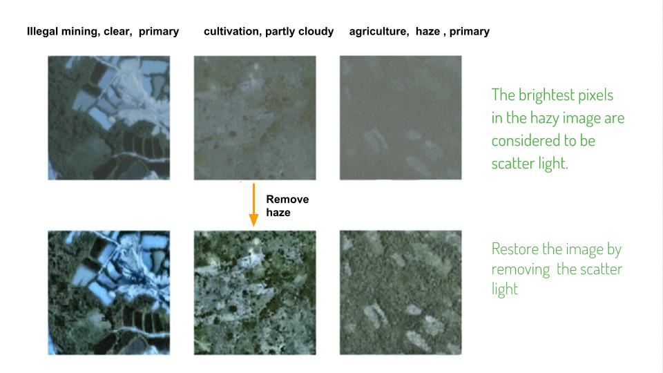

Amazon deforestation has been a serious concern over the past decades due to its devastating impact on biodiversity, habitat lost and climate change. One of the cause is the illegal gold mining. 

To pretect the beautiful Amazon forest from illegal mining, we can use satellite images combined with machine learning techniques to detect locations of such illegal activities. 

<!--more-->

#### Pre-process

---

Let's get started with downloading following files from kaggle competition  "[Planet: Understanding the Amazon from Space](https://www.kaggle.com/c/planet-understanding-the-amazon-from-space)". 

- train-jpg.tar.7z  
- test-jpg.tar.7z 
- train_v2.csv       -   labels for the train set

Extract images from 7z file and create two empty folder train_clean and test_clean.

We created a a00_remove_haze.py function based on  ["Single Image Haze Removal using Dark Channel Prior"](https://www.robots.ox.ac.uk/~vgg/rg/papers/hazeremoval.pdf) paper and increased the contrast after.


def print_hi(name)
  puts "Hi, #{name}"
end
print_hi('Tom')



Check out the [Jekyll docs][jekyll] for more info on how to get the most out of Jekyll. File all bugs/feature requests at [Jekyll’s GitHub repo][jekyll-gh]. If you have questions, you can ask them on [Jekyll’s dedicated Help repository][jekyll-help].

[jekyll]:      http://jekyllrb.com
[jekyll-gh]:   https://github.com/jekyll/jekyll
[jekyll-help]: https://github.com/jekyll/jekyll-help
